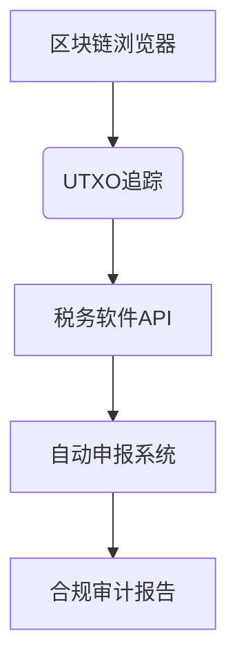

# 加密货币是否适用洗售规则？2025年税务规划全面指南

## 加密货币税务新规解读

**核心观点**：2025年加密货币市场迎来重大税务变革，SECURE 2.0法案正式将数字资产纳入洗售规则监管范围。投资者需特别注意以下要点：

👉 [加密货币税务规划工具](https://bit.ly/okx_welcome)

### 传统洗售规则的适用范围
洗售规则（Wash Sale Rule）旨在防止投资者通过"低卖高买"操作虚增税务亏损。根据美国国税局（IRS）现行规定：
- 证券类资产（股票/债券）适用30天窗口期
- 禁止61天窗口期内回购相同/实质性相同资产
- 亏损金额将计入新购资产成本基础

**关键数据**：2022年美国加密市场约有$280亿潜在税务漏洞，SECURE 2.0法案实施后预计堵住$120亿/年税收流失。

### 加密资产的特殊性演变
| 时间节点 | 监管定位 | 洗售规则适用性 |
|---------|----------|---------------|
| 2014-2022 | 财产属性 | 不适用 |
| 2023-2024 | 过渡期 | 部分试点 |
| 2025起 | 数字资产 | 完全适用 |

**典型案例**：2023年德州法院判例显示，比特币与WBTC的置换被认定为实质性相同资产交易，开创执法先例。

## 实务操作指南

### 实质性相同资产判定标准
| 资产配对 | 监管风险等级 | 处置建议 |
|---------|-------------|----------|
| BTC/WBTC | ★★★★★ | 谨慎操作 |
| ETH/stETH | ★★★★☆ | 保持警惕 |
| BTC/ETH | ★★☆☆☆ | 安全区 |
| USDT/USDC | ★★★☆☆ | 注意流动性 |

**专家提醒**：稳定币的"1:1锚定"特性可能引发新的监管争议，建议保持至少45天交易间隔。

### 税务优化策略矩阵
1. **时间窗口管理**
   - 建立30天交易观察期
   - 使用区块链浏览器追踪UTXO记录
2. **资产置换策略**
   - 跨链资产转换
   - Layer2资产迁移
3. **衍生品对冲方案**
   - 永续合约对冲
   - 期权组合策略

👉 [全球合规交易平台](https://bit.ly/okx_welcome)

## 常见问题解答（FAQ）

### 1. 洗售规则何时正式生效？
**答**：适用于2023年1月1日后产生的交易，首次报税周期为2024年申报2023年度税务。

### 2. 如何计算调整后成本基础？
**案例演示**：  
- 原持仓：1 BTC = $50,000  
- 出售收入：$40,000（亏损$10,000）  
- 30天内回购：1 BTC = $42,000  
- 调整后成本基础：$52,000（$42,000+$10,000）

### 3. 质押收益受何影响？
**要点解析**：  
- 质押奖励按普通收入征税  
- 不触发洗售规则  
- 需单独申报Staking收入

### 4. 如何规避合规风险？
**操作清单**：  
✅ 使用专业税务软件（如CoinTracking）  
✅ 建立多钱包管理体系  
✅ 交易间隔保持61天以上  
✅ 保留完整区块链交易记录

### 5. 跨境交易如何处理？
**国际税务要点**：  
- 美国税务居民全球征税  
- 需申报境外交易所持仓  
- 跨链转移需注明资产溯源

### 6. 未来监管趋势预测
**IRS路线图**：  
- 2025年Q2：发布实质性相同资产白皮书  
- 2025年Q4：实施区块链交易追踪系统  
- 2026年：纳入全球税务信息自动交换（CRS）

👉 [合规交易解决方案](https://bit.ly/okx_welcome)

## 战略建议

### 交易记录管理规范
1. **数据维度**：
   - 区块链哈希值
   - 交易所API记录
   - 钱包地址变更日志
2. **保存期限**：  
   - 基础数据：7年  
   - 对账凭证：10年  
   - 审计记录：永久

### 技术赋能方案

### 风险预警机制
- 建立30天交易预警系统
- 设置自动暂停交易功能
- 部署智能合约合规检查

## 行业影响分析

### 市场参与者应对策略
| 主体类型 | 短期影响 | 长期机遇 |
|---------|---------|---------|
| 散户投资者 | 交易成本上升 | 合规工具需求增长 |
| 机构投资者 | 策略调整期 | 合规外包服务市场 |
| 交易平台 | 合规支出增加 | 数据服务新业务线 |

**产业预测**：2025年加密税务软件市场规模将突破$3.8亿，年复合增长率达67%。

> **合规要点总结**：SECURE 2.0法案标志着加密货币市场监管进入成熟期，投资者应建立系统化合规管理体系，善用专业工具，把握政策窗口期完成战略转型。