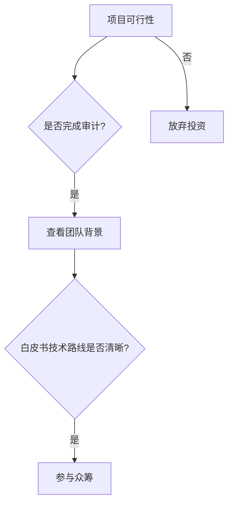

# 加密货币赚钱全攻略：2025年8种实用方法详解  

## 核心要点  
- 掌握2025年加密货币市场的8种主流盈利模式  
- 深度解析挖矿、质押、交易等核心策略的操作要点  
- 通过Token Metrics等工具实现科学投资决策  
- 平衡风险与收益，构建多元化数字资产组合  

---

## 新手入门指南  

### 加密货币研究与存储  

**加密货币研究**是开启数字资产投资的第一步。建议从以下维度展开：  
1. **项目基本面**：技术团队、白皮书创新性、落地应用场景  
2. **市值与流通量**：观察CoinMarketCap等平台的实时数据  
3. **社区活跃度**：通过Reddit、Twitter等渠道评估社群生态  

**安全存储方案**推荐：  
| 存储类型 | 优势 | 风险 |  
|---------|------|------|  
| 硬件钱包（Ledger/Trezor） | 离线存储最安全 | 设备丢失风险 |  
| 软件钱包（Trust Wallet） | 移动端便捷操作 | 需警惕病毒攻击 |  
| 交易所钱包（OKX） | 交易即时性高 | 选择合规平台是关键 |  

👉 [全球领先加密货币交易平台OKX](https://bit.ly/okx_welcome)  

---

## 加密货币挖矿：数字金矿探索  

### 硬件挖矿实战指南  
以比特币挖矿为例：  
1. **设备选择**：Antminer S19 Pro矿机算力达110TH/s，能效比29.5J/TH  
2. **矿池配置**：加入Slush Pool等知名矿池提升收益稳定性  
3. **电力成本**：需控制在$0.08/kWh以下方可持续盈利  

### 云挖矿风险提示  
| 服务商 | 算力类型 | 保底期限 |  
|--------|----------|----------|  
| Genesis Mining | SHA-256 | 2年 |  
| Hashflare | Scrypt | 1年 |  

> ⚠️ 注意：2024年云挖矿诈骗案例激增45%，建议优先选择OKX矿池等合规平台  

---

## 质押经济：稳赚收益策略  

### 年化收益TOP5币种（2025Q1数据）  
| 币种 | 质押收益 | 最低门槛 |  
|------|----------|----------|  
| Solana(SOL) | 5.8% | 0.01 SOL |  
| Ethereum(ETH) | 4.2% | 32 ETH（信标链） |  
| Cardano(ADA) | 3.9% | 10 ADA |  

**操作流程**：  
1. 创建MetaMask钱包  
2. 选择Coinbase等合规质押平台  
3. 设置自动复利功能  

👉 [OKX质押服务享受更高收益](https://bit.ly/okx_welcome)  

---

## 波段交易：把握市场脉搏  

### 技术分析三要素  
1. **量价关系**：BTC/USDT 1小时图成交量突破MA20是重要信号  
2. **斐波那契回撤**：ETH价格在$3000支撑位出现企稳形态  
3. **市场情绪指数**：当贪婪指数低于20时往往出现抄底机会  

### 风险控制矩阵  
| 止损幅度 | 仓位建议 | 适用周期 |  
|----------|----------|----------|  
| 2% | 10% | 趋势交易 |  
| 5% | 30% | 短线波段 |  

---

## 智能投顾：指数基金投资  

### 全球三大加密指数表现（2025.01-04）  
| 指数名称 | 年化收益 | 成分币种 |  
|----------|----------|----------|  
| CCI30 | 21.5% | 前30市值币种 |  
| BTC.E | 18.3% | 60%比特币+40%以太坊 |  
| DeFi Pulse | 35.2% | DeFi领域龙头 |  

**投资建议**：  
- 保守型：配置60%BTC.E+40%稳定币  
- 进取型：80%CCI30+20%行业ETF  

---

## 流动性挖矿：DeFi深度参与  

### 主流平台收益对比  
| 平台 | TVL（亿美元） | 稳定币APY | 风险评级 |  
|------|--------------|-----------|----------|  
| Curve Finance | 12.5 | 2.1%-4.7% | ★★ |  
| Aave | 8.9 | 浮动利率 | ★★★ |  
| Balancer | 6.3 | 双币池5-8% | ★★★★ |  

**操作技巧**：  
1. 使用Zapper工具一键管理多个头寸  
2. 关注Yearn Finance等机枪池  
3. 定期调整代币配比降低无常损失  

👉 [OKX DeFi专区获取最新收益数据](https://bit.ly/okx_welcome)  

---

## 项目孵化：参与早期投资  

### ICO投资决策树  

**风险提示**：2024年约63%的ICO项目未能兑现承诺，建议单笔投资不超过总仓位的5%  

---

## Token Metrics：AI驱动的投资神器  

### 核心功能矩阵  
| 功能模块 | 使用场景 | 优势对比 |  
|----------|----------|----------|  
| AI评分系统 | 项目价值评估 | 相比人工分析效率提升80% |  
| 组合优化器 | 资产再平衡 | 回测显示年化收益提升3-5% |  
| 风险预警 | 黑天鹅防范 | 提前24小时预警重大风险 |  

👉 [立即体验Token Metrics专业版](https://bit.ly/okx_welcome)  

---

## 风险收益全景图  

| 策略类型 | 年化预期 | 流动性 | 风险等级 |  
|----------|----------|--------|----------|  
| 短期交易 | 15-30% | 高 | ★★★★ |  
| 质押收益 | 4-8% | 中 | ★★ |  
| 指数基金 | 10-20% | 高 | ★★★ |  
| ICO投资 | 50%+ | 低 | ★★★★★ |  

---

## 常见问题解答  

### Q1：加密货币投资需要多少启动资金？  
A：理论上10美元即可参与，但建议初始资金不低于$500以分散风险。OKX等平台支持零手续费交易，适合新手起步。  

### Q2：如何判断优质项目？  
A：关注三点：是否有实际应用场景、团队技术实力、是否完成权威机构审计。推荐使用CoinGecko的项目评估工具。  

### Q3：熊市如何生存？  
A：采用「4321法则」：40%稳定币+30%核心资产+20%DeFi+10%观察仓。定期定额投资可平抑波动风险。  

### Q4：质押收益如何纳税？  
A：各国政策不同，美国IRS要求按普通收入计税（最高37%）。建议使用TokenTax等工具自动生成报税文件。  

### Q5：如何跟踪市场动态？  
A：关注CoinDesk、Coindar等资讯平台，加入OKX官方社群获取实时行情提醒，使用TradingView设置价格警报。  

---
