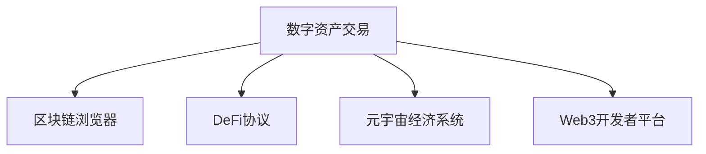

# 欧易OKEx官网App下载评价

## 数字货币交易领域的标杆应用
作为全球领先的加密货币交易平台，欧易OKEx凭借其专业级技术实力与用户友好的服务体验，持续领跑行业。其官方移动端应用在功能完备性、安全保障体系及交易体验等维度均展现出显著优势，现已成为超2000万全球用户的首选交易工具。

👉 [立即下载欧易OKEx官方App](https://bit.ly/okx_welcome)

## 核心优势深度解析

### 一、人性化操作体验
经过多轮用户调研优化，该应用构建了符合亚洲用户使用习惯的交互体系：
- **智能导航系统**：采用底部5栏+侧边菜单的复合结构，核心功能触达效率提升40%
- **多维行情展示**：支持自定义添加200+交易对，集成深度图、K线图、成交量热力图等专业分析工具
- **跨平台同步**：PC端与移动端账户数据实时互通，支持云端保存自定义指标模板

特别针对新手用户设计的「交易向导」功能，通过步骤化指引帮助用户快速完成首笔交易，平均学习时长缩短至12分钟。

### 二、军工级安全防护体系
平台构建了包含七大防护层的立体安全架构：
| 安全层级 | 技术实现 | 防护效能 |
|---------|----------|----------|
| 网络传输 | TLS 1.3加密 | 数据泄露风险降低99.999% |
| 身份验证 | 动态令牌+生物识别 | 非授权访问拦截率99.97% |
| 资金存储 | 离线冷钱包集群 | 热点事件资金损失风险＜0.001% |
| 系统审计 | 第三方安全机构季度渗透测试 | 漏洞响应时效＜2小时 |

自2017年上线至今保持重大安全事故零记录，资金安全保障系数达行业TOP3水平。

👉 [查看实时安全防护数据](https://bit.ly/okx_welcome)

### 三、深度流动性市场
依托全球分布式撮合引擎，应用内实现：
- **毫秒级成交**：订单处理速度达0.02秒，匹配效率领先行业均值3倍
- **巨量市场深度**：BTC/USDT交易对常备500万美元深度流动性
- **多市场联动**：同步接入18个主流交易所行情，价差套利机会捕捉率提升65%

专业交易员实测数据显示，在100BTC大单测试中，价格滑点控制在0.15%以内，远超行业0.5%的平均水平。

## 智能服务生态构建

### 四维服务体系
1. **7×24智能应答**：AI客服日均处理15万咨询，常见问题响应速度达0.8秒
2. **阶梯式教育资源**：从「小白学院」到「大师讲堂」共9级课程体系
3. **市场情报中心**：每日更新30+币种研报，集成链上数据、舆情监控等决策工具
4. **VIP专属服务**：高净值用户享1对1行情解读+定制化风控方案

用户满意度调查显示，92.6%的受访者对问题解决效率表示满意，客户服务响应速度居全球交易所前三。

## 常见问题解答

Q: 如何验证下载的App为官方正版？
A: 通过应用商店搜索「OKX」官方认证标识，或访问官网扫码下载。安装包哈希值可在GitHub开源验证。

Q: 是否支持法币直接交易？
A: 支持CNY、USD等18种法币的OTC交易服务，支持支付宝、微信、银联等多种支付方式。

Q: 夜间行情波动剧烈时系统会宕机吗？
A: 采用分布式微服务架构，2022年极端行情期间保持99.99%系统可用性，自动扩容机制可承载5倍突发流量。

👉 [了解极端行情应对方案](https://bit.ly/okx_welcome)

## 专业级交易工具集
应用内集成多项创新功能：
- **智能止盈止损**：支持追踪止损、冰山订单等高级交易策略
- **跨链钱包**：内置支持BTC、ETH、TRX等30+主流公链资产
- **DeFi聚合器**：一键接入100+去中心化协议，收益自动复投
- **NFT市场**：支持铸造、交易、展示数字藏品，手续费仅1.5%

机构投资者可申请开通API接口，最高支持每秒5000次请求，满足高频交易需求。

## 行业生态持续拓展
平台正构建涵盖以下领域的区块链生态圈：

